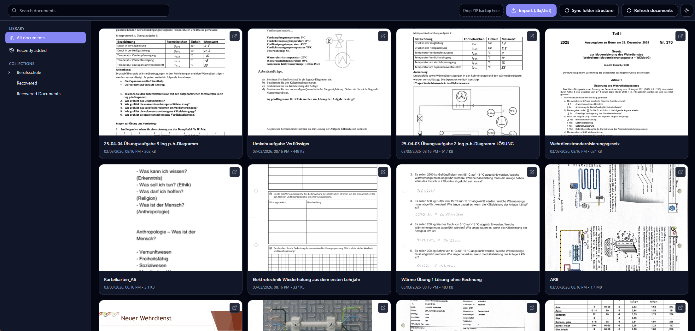
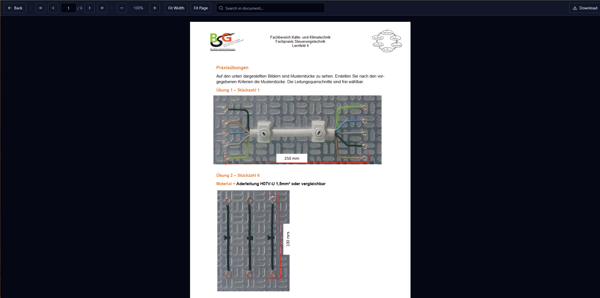
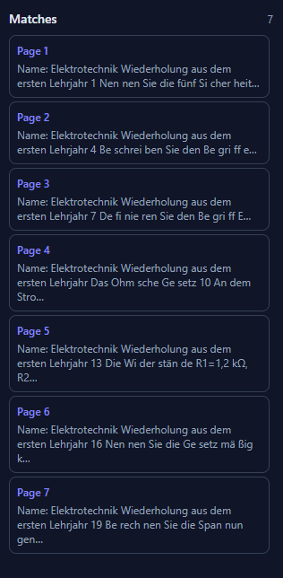

<p align="center">
  
</p>

<p align="center">
  <b>A modern, local-first desktop viewer for Flexcil backup files.</b>
</p>

<p align="center">
  ⚡ Fast • 🔎 Full-Text Search • 📂 Folder Structure • 🔐 100% Local
</p>

---

# Flexcil Backup Viewer

A clean and powerful desktop application to view and search Flexcil backup files on your computer.

> ⚠️ This project is not affiliated with, endorsed by, or connected to Flexcil in any way.

---

## ✨ Features

- 📂 Rebuilds folder structure from `documents.list`
- 📄 Extracts PDFs from backup ZIP / `.flx` files
- 🔎 Real-time full-text search
- 📑 Jump-to-page navigation
- 🖼 Thumbnail preview grid
- 📊 Import progress indicator
- 💾 IndexedDB local storage
- 🌙 Modern dark UI
- 🔐 100% local — no uploads, no cloud interaction

---

## 🖼 Screenshots

### 📚 Library View
<p align="center">
  
</p>

Modern folder sidebar with thumbnail grid and metadata overview.

---

### 📄 Document Viewer
<p align="center">
  
</p>

Built-in PDF.js viewer with navigation, zoom, and jump-to-page support.

---

### 🔎 Full-Text Search
<p align="center">
  
</p>

Instant search across all indexed documents with live updates.

---

## ⬇️ Download (Windows .exe)

If you don’t want to run the development version, you can download the standalone Windows executable from the **Releases** section.

### Steps:

1. Go to the GitHub **Releases** page.
2. Download the latest `.exe` file.
3. Double-click to start the application.
4. Your browser will open automatically.

No installation required.

---

## 🚀 Getting Started (Development Version)

### 1. Clone repository

```bash
git clone https://github.com/janptn/flexcil-backup-viewer.git
cd flexcil-backup-viewer
```

### 2. Install dependencies

```bash
npm install
```

### 3. Start development server

```bash
npm run dev
```

Open the shown local URL in your browser.

---

## 📦 How To Use

### Importing Documents

1. Download your Flexcil backup ZIP from Google Drive.
2. Drag & drop the ZIP file into the app.
3. The app automatically:
   - Extracts PDFs
   - Rebuilds folder structure
   - Indexes document text
   - Stores everything locally in IndexedDB

---

### Updating With New Documents

Whenever you create new documents on your tablet:

1. Download the latest Flexcil backup ZIP from Google Drive.
2. Drag & drop it into the app again.
3. The viewer automatically:
   - Detects new documents
   - Skips already imported ones
   - Updates the library instantly

You can repeat this process anytime.

No manual cleanup required.

---

## 🔐 Privacy

- No telemetry
- No tracking
- No cloud sync
- No external uploads
- All data stored locally in your browser

You can clear stored data anytime via browser storage settings.

---

## 💡 Why This Exists

Flexcil is tablet-first.  
This tool provides a fast and clean desktop viewing experience without requiring official desktop support.

Built for productivity and open-source collaboration.

---

## ⚖️ Legal Notice

Flexcil is a trademark of its respective owners.

This project is an independent viewer for user-generated backup files and does not interact with official Flexcil services.

---

## 📜 License

MIT License © 2026 Jan Pultin
